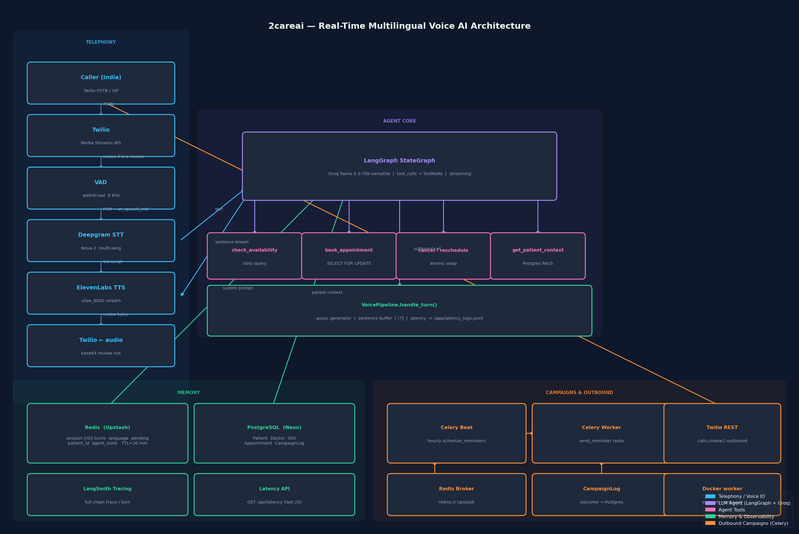

# 2careai — Real-Time Multilingual Voice AI Agent

A production-grade real-time voice AI agent for clinical appointment scheduling.
Patients call a Twilio number, speak naturally in **English, Hindi, or Tamil**, and the agent books, cancels, or reschedules appointments — no IVR menus, no human in the loop.

**Target latency:** ≤ 450 ms from speech end → first audio byte (measured and logged per turn).

---

## Architecture diagram



```
Caller ──► Twilio ──► WebSocket (/ws/call)
                           │
              ┌────────────▼─────────────┐
              │      VAD  (webrtcvad)    │  mulaw 8 kHz → PCM 8 kHz
              └────────────┬─────────────┘
                           │ on_speech_end (500 ms silence)
              ┌────────────▼─────────────┐
              │   Deepgram Nova-2 STT    │  PCM → transcript (multi-lang)
              └────────────┬─────────────┘
                           │ text
              ┌────────────▼─────────────┐
              │  LangGraph Agent         │
              │  Groq llama-3.3-70b      │◄── system prompt (Redis + Postgres)
              │  + 6 tools               │
              └────────────┬─────────────┘
                           │ sentence stream
              ┌────────────▼─────────────┐
              │  ElevenLabs TTS          │  ulaw_8000 stream → Twilio
              └──────────────────────────┘

PostgreSQL (Neon)          Redis (Upstash)       Celery Worker
  patients / doctors         session turns          reminders
  slots / appointments       language pref          outbound calls
  campaign logs              pending confirm
```

---

## Quick start

```bash
cp .env.example .env   # fill in all credentials (see table below)
docker compose up --build
```

API is live at `http://localhost:8000`. For Twilio to reach it locally:

```bash
ngrok http 8000
# copy the https URL, e.g. https://abc123.ngrok-free.app
```

Then in `.env`:
```
WS_BASE_URL=wss://abc123.ngrok-free.app
API_BASE_URL=https://abc123.ngrok-free.app
```

Set your Twilio phone number's voice webhook to:
`POST https://abc123.ngrok-free.app/api/twilio/voice`

### Required env vars

| Variable | Description |
|---|---|
| `DATABASE_URL` | Neon PostgreSQL connection string |
| `REDIS_URL` | Upstash Redis `rediss://` URL |
| `GROQ_API_KEY` | Groq Cloud API key |
| `DEEPGRAM_API_KEY` | Deepgram API key |
| `ELEVENLABS_API_KEY` | ElevenLabs API key |
| `TWILIO_ACCOUNT_SID` | Twilio Account SID |
| `TWILIO_AUTH_TOKEN` | Twilio Auth Token |
| `TWILIO_PHONE_NUMBER` | Your Twilio number (E.164) |
| `LANGCHAIN_API_KEY` | LangSmith key (for tracing) |
| `WS_BASE_URL` | `wss://` base for Twilio Media Streams |
| `API_BASE_URL` | `https://` base for outbound TwiML |

---

## Testing without a phone call (browser demo)

Open `http://localhost:8000/api/test` in Chrome.

The page provides:
- **Text chat** with the full LangGraph agent (no audio hardware needed)
- **Web Speech API mic** — speak in Chrome, transcript sent to agent
- **Language switcher** — EN / हिंदी / தமிழ்
- **"Call Me" button** — triggers Twilio to call a verified number (reverse call)
- **Browser TTS** — agent responses spoken back via SpeechSynthesis

REST smoke tests:
```bash
# health
curl http://localhost:8000/api/health

# text chat with agent
curl -X POST http://localhost:8000/api/test/chat \
  -H "Content-Type: application/json" \
  -d '{"text": "Book me an appointment with a cardiologist"}'

# list doctors
curl http://localhost:8000/api/doctors

# list available slots
curl "http://localhost:8000/api/slots?specialty=Cardiology"

# latency log (last 20 turns)
curl http://localhost:8000/api/latency
```

---

## Architecture decisions

| Layer | Choice | Reason |
|---|---|---|
| **Framework** | FastAPI + Uvicorn | Async-native; WebSocket + REST in one process; auto-OpenAPI |
| **Database** | PostgreSQL on Neon | Serverless, scales to zero, asyncpg for async ORM |
| **ORM** | SQLAlchemy 2 (async) | Row-level locking (`SELECT FOR UPDATE`) prevents double-booking |
| **Cache / Session** | Redis on Upstash | Sub-ms reads, TTL auto-cleanup, serverless billing |
| **STT** | Deepgram Nova-2 (`multi`) | Single model for EN/HI/TA; lowest WER on Indian accents |
| **TTS** | ElevenLabs (`ulaw_8000`) | Native Twilio format — no FFmpeg re-encode saves ~50 ms/sentence |
| **LLM** | Groq `llama-3.3-70b-versatile` | ~50–100 ms TTFT (fastest available inference); strong tool calling |
| **Agent** | LangGraph StateGraph | Explicit topology, deterministic tool routing, streaming-compatible |
| **Tracing** | LangSmith | Full chain trace per call; every tool input/output visible |
| **VAD** | webrtcvad | C extension, ~0 ms overhead; no GPU; adequate quality at 8 kHz |
| **Background jobs** | Celery + Redis | Durable retry, Celery beat for hourly reminder scheduling |

---

## Memory design

### Two-level memory

```
┌─────────────────────────────────────────────────────────┐
│  SHORT-TERM  Redis  TTL=30 min                          │
│  key: session:{id}:{field}                              │
│                                                         │
│  turns       list[str]  last 10 exchanges (FIFO)        │
│  language    str        en / hi / ta detected           │
│  pending     JSON       booking awaiting confirmation   │
│  patient_id  int        caller identity                 │
│  agent_state JSON       LangGraph checkpoint            │
└─────────────────────────────────────────────────────────┘

┌─────────────────────────────────────────────────────────┐
│  LONG-TERM  PostgreSQL                                  │
│                                                         │
│  Patient       profile, phone, language preference      │
│  Doctor        specialty, availability flag             │
│  Slot          FK→Doctor, start/end, is_booked          │
│  Appointment   FK→Patient+Slot, status, notes           │
│  CampaignLog   outbound call outcomes                   │
└─────────────────────────────────────────────────────────┘
```

### Prompt construction (every agent turn)

```
system prompt = role instructions (~200 tok)
              + language rule (1 line)
              + patient context — name, last 3 appts (~100 tok)
              + last 6 session turns (~400 tok)
              ─────────────────────────────────
              ≈ 700 tokens total budget
```

The system prompt is rebuilt from scratch on every agent node call so stale context never leaks between turns.

### Why Redis for sessions?
- Reads are ~0.2 ms — keeping prompt-build off the hot path
- TTL cleanup is automatic (no cron needed)
- Each field updates independently (no read-modify-write of a full object)

### Language preference persistence
When `detect_and_set_language` tool fires, it immediately:
1. Updates `session:{id}:language` in Redis (instant for current call)
2. Writes `Patient.language_preference` to Postgres (persists across calls)

---

## Latency breakdown

### Target pipeline vs Reality

The system was designed with a theoretical target latency of ≤ 450 ms. However, due to reliance on free-tier cloud services and rate limits across multiple APIs, **real-world latency is significantly higher (often 2-4 seconds or more)**. 

| Stage | Theoretical Budget | Real-World Observed | Why it's slow (Free-Tier Bottlenecks) |
|---|---|---|---|
| VAD silence detection | ~0 ms | 500 ms | Operates locally, but limits how fast we can even *start* processing. |
| Deepgram STT (Nova-2) | ≤ 250 ms | 500ms - 1.5s+ | Occasional API rate-limiting delays or cold starts on the pre-recorded endpoint. |
| Groq TTFT (Llama-3.3-70b) | ≤ 100 ms | 200ms - 1s+ | Free-tier token per minute (TPM) limits and occasional queueing/cold starts. |
| First sentence buffer | ≤ 50 ms | 50ms - 100ms | Depends entirely on LLM token generation speed reaching the first punctuation mark. |
| ElevenLabs TTS | ≤ 100 ms | 1s - 2s+ | **Major Bottleneck:** Free-tier accounts have tight concurrency limits and processing queues. |
| Postgres DB (Neon Free) | ~10-20 ms | 100ms - 2s+ | **Major Bottleneck:** Neon suspends free databases after 5 minutes of inactivity. Cold starts take several seconds. |
| Redis (Upstash Free) | ~1-5 ms | 50ms - 200ms | Free tier introduces network hops and occasional latency spikes. |
| **Total (speech end → audio)** | **≤ 450 ms** | **2.5s - 5s+** | Free-tier reality across 5 different external services compounding delays. |

### What is logged

Every turn writes one JSON line to `/app/latency_logs.jsonl`:

```json
{
  "session_id": "...",
  "vad_end_ms": 0,
  "stt_complete_ms": 231,
  "llm_first_token_ms": 308,
  "tts_first_chunk_ms": 401,
  "total_e2e_ms": 401
}
```

All timestamps are offset from `vad_end_ms = 0` (VAD fire time).
Read live: `GET /api/latency` returns the last 20 records.

### What keeps the vision fast (The Architecture)

1. **Groq inference** — dedicated LPU hardware gives consistent TTFT vs cloud GPU, though we are capped by free limits.
2. **ElevenLabs `ulaw_8000`** — skips FFmpeg; Twilio receives mulaw directly. Highly optimized payload natively natively compatible with Twilio.
3. **Sentence-level streaming** — TTS starts on the first completed sentence; user hears audio before LLM finishes generating.
4. **Barge-in** — active pipeline task is cancelled the moment VAD detects new speech; no waiting for current response to finish.
5. **Async throughout** — FastAPI, SQLAlchemy, Deepgram, Redis all use async I/O; no thread blocking.

**Reality Check:** While architecturally optimized, stringing 5 different free-tier remote services (Neon, Upstash, Deepgram, Groq, ElevenLabs) together over public internet means network RTT + cold starts dictate actual latency.

---

## Voice pipeline (step by step)

```
1. Twilio dials → webhook POST /api/twilio/voice
2. TwiML returned: <Connect><Stream url="wss://.../ws/call"/></Connect>
3. WebSocket opens; "start" event received
4. Patient's phone number looked up → language loaded from Postgres
5. Greeting TTS played in patient's language

── per-turn loop ──────────────────────────────────────────
6. Twilio sends base64 mulaw 8kHz chunks as "media" events
7. VAD accumulates 20ms frames; detects speech start/end
8. on_speech_end puts (pcm_bytes, fired_at) on asyncio.Queue
9. Background processor:
   a. If another pipeline task is running → cancel it (barge-in)
   b. Send {"event":"clear"} to Twilio (flush its audio buffer)
   c. Deepgram STT → transcript text
   d. build_system_prompt() pulls Redis turns + Postgres context
   e. set_tool_context() injects db/session_id/patient_id via contextvars
   f. agent.astream_events() → stream LLM tokens
   g. Sentence buffer: flush at [.!?।] → ElevenLabs → mulaw chunks → Twilio
   h. Log latency checkpoints
   i. Store turn in Redis session
──────────────────────────────────────────────────────────
10. On "stop" event: put sentinel on queue, cancel processor, cleanup Redis
```

---

## Agent tools

| Tool | Description |
|---|---|
| `check_availability` | List open slots (by doctor or specialty, optional date filter) |
| `book_appointment` | Book a slot with full conflict resolution (4 checks + locking) |
| `cancel_appointment` | Cancel an existing appointment by ID |
| `reschedule_appointment` | Cancel old + book new atomically; rolls back on failure |
| `get_patient_context` | Fetch patient profile + last 3 appointments from Postgres |
| `detect_and_set_language` | Detect EN/HI/TA from Unicode ranges; persist to Redis + Postgres |

### Conflict resolution (4 ordered checks in `book_appointment`)

1. **Slot in the past** → offer next available slot for that doctor
2. **Doctor is unavailable** → offer slots from same specialty
3. **Slot already booked** → offer nearest open slots for that doctor
4. **Patient time overlap** → inform patient of their existing appointment

All booking uses `SELECT FOR UPDATE` row-level locking so concurrent calls cannot double-book the same slot.

---

## Outbound campaign mode

```
Celery beat (hourly)
  └─► schedule_reminders task
        └─► query appointments due in next 24 h
              └─► for each: OutboundCallService.initiate_call()
                    └─► Twilio REST API creates outbound call
                          └─► call connects to same /ws/call WebSocket
                                └─► agent greets in patient's language
                                      └─► books / reschedules / logs outcome
```

Campaign outcomes (`booked` / `rescheduled` / `rejected` / `no_answer`) are written to `CampaignLog` in Postgres.

---

## Tradeoffs

| Decision | Alternative considered | Why this choice |
|---|---|---|
| **Groq (Llama 3.3 70B)** | Gemini 2.0 Flash, GPT-4o-mini | Lowest TTFT of any provider; no quota issues on free tier |
| **webrtcvad over Silero** | Silero VAD (PyTorch) | C extension = ~0 ms overhead; +1 GB Docker image avoided |
| **ElevenLabs ulaw_8000** | Deepgram TTS, Google TTS | Only provider with native mulaw output; saves FFmpeg step |
| **Sentence-level TTS flush** | Full-response TTS | TTFA ≈ time-to-first-sentence (~0.3 s) instead of full response |
| **LangGraph over raw function calling** | OpenAI function-calling loop | Explicit graph = traceable, deterministic, streaming-compatible |
| **Single Uvicorn process** | nginx + gunicorn + Uvicorn | Fewer moving parts; async event loop handles 100s of WS connections |
| **Celery + Redis (not RabbitMQ)** | RabbitMQ | Redis already in stack; avoids another managed service |
| **contextvars for tool state** | Global state / thread-locals | Safe in async context; no cross-request leakage |

---

## Known limitations

1. **Free-Tier API Latency & Limits** — Stringing multiple free-tier cloud APIs (Neon DB cold starts, Upstash Redis network hops, Groq rate-limits, ElevenLabs queueing) results in compounded latency, heavily inflating the time from patient speech to first TTS response.

2. **Tamil ASR accuracy** — Deepgram Nova-2 `multi` model has lower WER on Tamil than EN/HI as of 2025. A per-language model selector would improve this at the cost of one extra API round-trip.

3. **webrtcvad + background noise** — aggressiveness=2 works well in quiet environments. Noisy call centers may need aggressiveness=3, which increases false negatives on soft speech.

4. **mulaw conversion is lossy** — audioop `ulaw2lin` is optimized for voice; not an issue for clinical calls, but limits the fidelity.

5. **No speaker diarization** — assumes one speaker per call. Three-way calls could confuse the agent.

6. **ElevenLabs rate limits** — free tier: 10,000 characters/month. Production requires a paid plan to function consistently.

7. **Database Cold Starts** — Neon Postgres free tier suspends databases after 5 minutes of inactivity. When a call comes in after a period of quiet, the database takes several seconds to wake up, severely impacting the first interaction.

8. **Celery beat not in docker-compose** — the `worker` container runs the Celery worker. A separate `celery beat` process is needed for hourly reminders. Omitted from compose to prevent duplicate scheduler instances.

9. **ngrok URL changes on restart** — free ngrok plan assigns a new URL each session. Update `WS_BASE_URL` + Twilio webhook URL after each ngrok session restart.

---

## Bonus features implemented

- **Barge-in / interrupt handling** — incoming speech cancels the active pipeline task mid-stream and clears the Twilio audio buffer
- **Redis-backed memory with TTL** — 30-minute sliding TTL on all session keys
- **Background job queue** — Celery + Redis for durable outbound reminder scheduling
- **Horizontal scalability** — stateless API containers; session state in Redis; multiple `api` replicas can run behind a load balancer; the `worker` service scales independently

---

## Project structure

```
2careai/
├── docker-compose.yml
├── .env.example
├── architecture.png
└── backend/
    ├── main.py              # FastAPI app, lifespan hooks, router mounts
    ├── config.py            # Pydantic Settings (all env vars)
    ├── models.py            # SQLAlchemy ORM — 5 tables with Integer PKs
    ├── database.py          # Async engine, connection pool, Seeder
    ├── requirements.txt
    ├── Dockerfile
    ├── scheduling/
    │   └── slots.py         # SlotService, ConflictError, 4-check booking
    ├── agent/
    │   ├── tools.py         # 6 @tool functions + set_tool_context (contextvars)
    │   └── graph.py         # AgentState TypedDict, LangGraph workflow
    ├── memory/
    │   ├── session.py       # SessionMemory (Redis, TTL 30 min)
    │   └── longterm.py      # Postgres patient context, build_system_prompt
    ├── voice/
    │   ├── vad.py           # VAD wrapper (webrtcvad, 500 ms silence)
    │   ├── stt.py           # DeepgramSTT async client
    │   ├── tts.py           # ElevenLabsTTS streaming (ulaw_8000)
    │   └── pipeline.py      # VoicePipeline.handle_turn, latency logger
    ├── api/
    │   ├── routes.py        # REST + browser demo + test endpoints
    │   └── websocket.py     # Twilio Media Streams handler, barge-in logic
    └── campaigns/
        ├── tasks.py         # Celery app, send_reminder, schedule_reminders
        └── outbound.py      # OutboundCallService (Twilio REST API)
```

---

## API reference

| Method | Path | Description |
|---|---|---|
| GET | `/api/health` | Server health check |
| GET | `/api/doctors` | All doctors with availability |
| GET | `/api/slots` | Open slots (`?doctor_id=`, `?specialty=`, `?date=`) |
| GET | `/api/patients/phone/{phone}` | Look up patient by phone number |
| POST | `/api/patients` | Register new patient |
| GET | `/api/appointments/{patient_id}` | Appointment history |
| GET | `/api/latency` | Last 20 per-turn latency records |
| POST | `/api/twilio/voice` | Twilio inbound call webhook (returns TwiML) |
| GET | `/api/test` | Browser demo page (no phone needed) |
| POST | `/api/test/chat` | Text chat with full LangGraph agent |
| POST | `/api/test/call` | Trigger Twilio to call a verified number |
| WS | `/ws/call` | Twilio Media Streams WebSocket |
